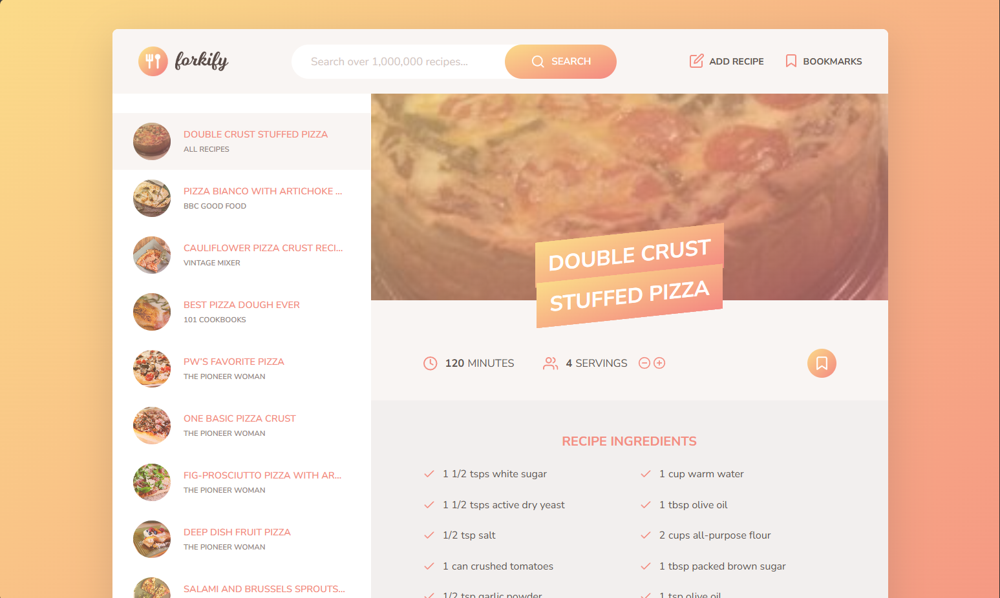

# 🍳 Forkify – Aplicación de Recetas

## 📖 Descripción General

**Forkify** es una aplicación web desarrollada con **JavaScript moderno (ES6+)** que permite buscar, visualizar, guardar y subir recetas de cocina de forma interactiva.  
El proyecto implementa el **patrón de arquitectura MVC (Model-View-Controller)** para lograr un código modular, mantenible y escalable.

A través del consumo de la **API pública de Forkify**, el usuario puede realizar búsquedas de recetas por nombre, ajustar el número de porciones, agregar recetas a favoritos (bookmarks) y hasta subir sus propias creaciones culinarias mediante un formulario dinámico.

---

## 🖼️ Vista Previa de la Aplicación



---

## ⚙️ Estructura del Proyecto

El proyecto está compuesto por diferentes módulos, organizados de acuerdo con el patrón **MVC**:
El proyecto está compuesto por diferentes módulos, organizados de acuerdo con el patrón **MVC**:

src/
│
├── js/
│ ├── controller.js # Controlador principal: coordina vistas y modelo
│ ├── model.js # Maneja el estado global y las peticiones a la API
│ ├── config.js # Configuraciones globales (API URL, API Key, etc.)
│ ├── helpers.js # Funciones auxiliares para fetch y control de errores
│
└── views/ # Carpeta con las vistas del proyecto
├── recipeView.js
├── searchView.js
├── resultsView.js
├── paginationView.js
├── bookmarksView.js
└── addRecipeView.js

index.html
package.json

---

## 🧩 Descripción del Archivo `controller.js`

El archivo `controller.js` es el **núcleo del sistema de control** de la aplicación.  
Su función principal es actuar como intermediario entre el **modelo (`model.js`)** y las **vistas (`views/`)**, garantizando una comunicación coherente entre la lógica de datos y la interfaz de usuario.

### Principales funcionalidades:

| Función                        | Descripción                                                                        |
| ------------------------------ | ---------------------------------------------------------------------------------- |
| `controlRecipes()`             | Carga y renderiza la receta seleccionada según el ID en la URL.                    |
| `controlSearchResults()`       | Gestiona las búsquedas ingresadas por el usuario y renderiza los resultados.       |
| `controlPagination(goToPage)`  | Controla la paginación de resultados de búsqueda.                                  |
| `controlServings(newServings)` | Actualiza dinámicamente las cantidades de ingredientes al modificar las porciones. |
| `controlAddBookmark()`         | Añade o elimina recetas del listado de marcadores (bookmarks).                     |
| `controlBookmarks()`           | Renderiza los marcadores guardados al cargar la página.                            |
| `controlAddRecipe(newRecipe)`  | Permite subir nuevas recetas a la API y renderizarlas en la interfaz.              |
| `init()`                       | Inicializa los controladores y listeners de eventos al cargar la aplicación.       |

---

## 🌐 Dependencias

Para ejecutar correctamente el proyecto, se deben instalar los siguientes paquetes:

```bash
npm install core-js regenerator-runtime parcel

```

Estos polyfills garantizan compatibilidad con navegadores antiguos y permiten el uso de async/await.

---

🚀 Ejecución del Proyecto

1. Instalar dependencias

```bash
npm install
```

2. Iniciar el servidor de desarrollo con Parcel

```bash
npm run start
```

3. Abrir en el navegador

```bash
http://localhost:1234
```

En el archivo config.js debe definirse una API Key válida para el correcto funcionamiento del proyecto:

export const API_URL = 'https://forkify-api.jonas.io/api/v2/recipes/';
export const KEY = 'TU_API_KEY_AQUI';
export const MODAL_CLOSE_SEC = 2.5;

Puedes obtener una clave gratuita en https://forkify-api.jonas.io

---

🧠 Conceptos Técnicos Aplicados

- Arquitectura MVC (Model–View–Controller)
- Programación asíncrona con async/await
- Fetch API para comunicación con un servicio REST
- Modularización ES6 (import/export)
- Actualización selectiva del DOM (sin recargar la página)
- Manejo de estado global
- Persistencia local mediante localStorage
- Uso de polyfills (core-js, regenerator-runtime)

---

🏁 Estado del Proyecto

✅ Funcional y operativo.
Pendiente de posibles mejoras en el diseño visual, manejo de errores avanzados y validación de formularios de subida de recetas.
